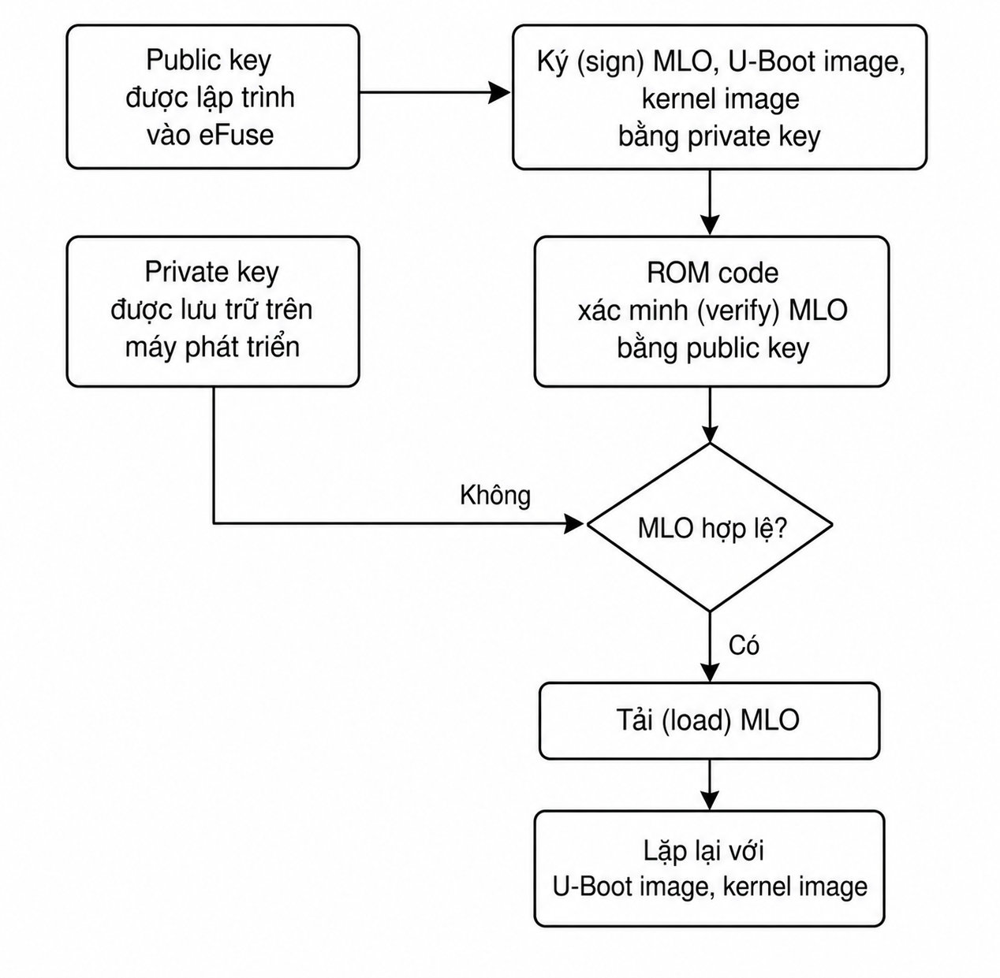

# Secure boot

## Tại sao phải có secure boot?
- Tại sao phải có secure boot?
- Tại sao phải có verify key rồi mới được boot?
- Chống lại flash software lạ vào trong thiết bị?

## Câu chuyện
### Bối cảnh
- có 1 camera
  - họ dump image giải nén được root file system, build thêm application ở ngoài và tích hợp thêm vào.

### secure boot
- nếu như image không phải của hãng thì thiết bị sẽ không boot.
- làm thế nào một con thiết bị biết được thiết bị đấy của hãng của hãng hay ko thì nó dựa vào chuỗi public key, private key -> gọi là kỹ thuật khóa 1 chiều, tư tưởng như sau:
  - image sau khi build xong, phải thực hiện check sum, sign bằng private key.
  - boot room, sau khi đọc image từ sdcard, sẽ verify chữ ký bằng public key. Public key được lưu ở trên boot room.
  - public hết trên mạng ai thích xem thì xem nhưng tất cả file binary của tôi sẽ ký bằng private key tạo ra một cái mã. Thì người bên ngoài cái key tôi sinh ra đúng của hãng đấy họ sẽ so sánh nó với public key. Không dịch ngược được private key sang public key chỉ so sánh được với public key thôi.

**Ví dụ thực tế:** đã có rất nhiều vụ lộ `clip` trên camera (mua camera từ trung quốc đè tem vn rồi bán lại), tưởng tượng bạn ra cửa hàng mua wifi nghĩ là uy tín nhưng mà thực ra nó vẫn bị hack có thể nó vẫn tự động livestream về server của người ta mà mình không biết --> từ đó người ta sinh ra `secure boot`. Trong các thiết bị bây giờ dùng rất là nhiều trong các thiết bị bây giờ. Đảm bảo thiết bị an toàn hơn không bị tấn công.

**Ghi chú:** Ở việt nam thì mới phát triển tầm 4-5 năm, nhưng trong beagle bone black người ta đã support cách đây tầm 20 năm rồi.

## Cơ chế secure boot
### 1. Máy build - đặt tại office
- Trong máy build sẽ có source code, private key
- Thực hiện build souce code ra file binary `am335x_yocto.img`.
- Thực hiện ký image bằng private key ra được file mới `am335x_yocto_signed.img`.

> đây là quá trình build.

### 2. Quá trình boot trong beagle bone black
- Boot Rom sẽ lưu public key.
- Boot Rom sẽ đối chiếu chữ ký trên `am335x_yocto_signed.img` với public key
- Lưu ý: chữ ký không phải `public key` nó là tổ hợp với `public key` với `checksum`.
- Nếu chữ ký trùng khớp với `public key` thì `boot room` mới `load image` lên.

### 3. Beaglebone black có nhiều phiên bản
- bản `50$`: phần cứng nó sẽ không hỗ trợ `secure boot`.
- bản `100$`: có hỗ trợ mua về tay rơi vào 4 triệu cho 1 board beaglebone. Phần cứng chạy ổn định hơn so với `50$` như ở môi trường độ ẩm, nhiệt độ cao có thể chạy ổn định nhiều năm hơn so với `50$`.
- để có thể ghi được `public key` vào vùng nhớ rom của BBB, chúng ta phải liên hệ hãng sản xuất để mua `license` của tool. Board chỉ hỗ trợ 1 lần duy nhất.
- tuy nhiên, trên thị trường có 1 số dòng SoC rất thân thiện với người dùng trong việc support secure boot. Ví dụ như `jetson origin` tool để flash `public key` hoàn toàn `free`.

> Nếu mà image người ta thực hiện thay đổi data trong image đấy thì sao. Tức là trong một image người ta đã thực hiện ký rồi và người ta thực hiện thay đổi data hay replace trong image đấy thì sao?

- Khi data thay đổi thì mã checksum sẽ thay đổi thì chữ ký đấy sẽ không còn hợp lệ nữa vì chữ ký gắn liền với public key và checksum.

## Tư tưởng
Trong dự án nếu cần làm secure boot thì cơ bản không quan trọng các bước thực hiện chỉ cần nắm được tư tưởng secure boot dựa vào 3 thứ là:
- khóa 1 chiều (public key và private key)
- chữ ký số (tổ hợp của checksum + public key)
- secure boot check được chữ ký số có hợp lệ hay không?

Bất cứ hãng nào cũng sẽ đều dựa trên nguyên lý đấy nhưng các bước thực hiện ghi public key vào trong board như nào thì sẽ khác ở từng hãng.

## Nhược điểm
Secure boot vẫn chưa đủ.

Khi mà `runtime`: `signed.image` trong `sdcard` sẽ `load` vào `RAM`. Nhưng nếu hacker can thiệp vào RAM thì sao? Hacker sẽ can thiệp và thay đổi dữ liệu trong RAM tại một cái vùng nhớ nào đó họ chèn mã đọc, code của họ vào thì sao? Làm sao để board có thể bảo vệ trong tình huống này ?

Việc tấn công không đơn giản người ta có các thiết bị thao tác kết nối vật lý có thể nó sẽ đi vào từ những đường rất chính thống. Ví dụ như linux có rất nhiều lỗ hổng như qua ssh, qua serial, ... hacker họ biết được cái lỗ hổng đấy họ đi thẳng qua các lỗ hổng này. Như thiết bị của chúng ta đang dùng kernel v4.15 chẳng hạn thì có rất nhiều lỗ hổng liên quan đến bảo mật được public lên mạng cho bản v4.15 nó được gọi là `CVE`. Nếu như tôi đọc một cái `CVE` và tôi làm theo thì tôi sẽ tấn công được vào bản kernel mà nó chưa có bản vá này. Hacker họ không cần có trình cao họ chỉ cần làm đúng các kịch bản trong `CVE` thì họ sẽ tấn công được vào họ đi vào trong bộ nhớ mình không kiểm soát được.

Ví dụ như hacker có thể leo quyền thông qua việc ssh.

# U-boot

